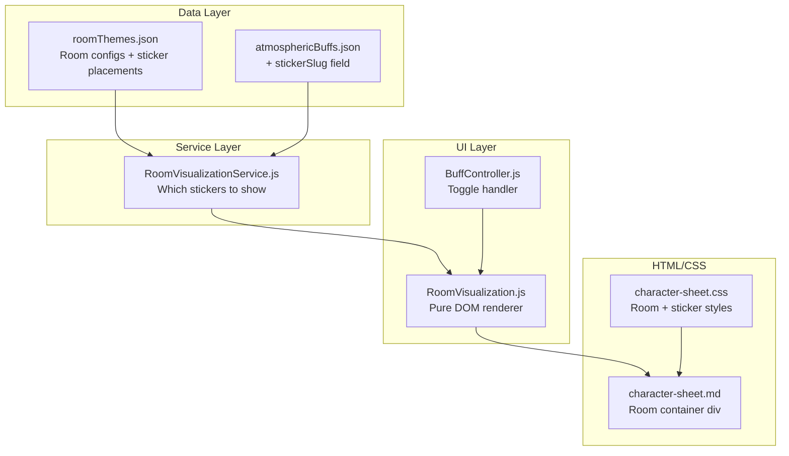

# Atmospheric Buff Room Visualization

## Approach: Fine-Tuned Placement (not drag-and-drop)

Each sticker has a designated physical slot in the room (fireplace, dresser, reading nook, etc.), so **predefined position/scale per sticker** is the right fit. This avoids the complexity of persisting drag positions, produces a polished result, and matches the semantic intent of the stickers. Positions are defined as percentage-based CSS values in a JSON config, making iteration straightforward -- just tweak the numbers.

## Architecture Overview




## Key Design Decisions

- **Percentage-based positioning**: All sticker positions use `top`, `left`, `width` as percentages of the room container, making the visualization responsive.
- **Data-driven themes**: Room themes are defined in JSON. Adding a sci-fi or fantasy room later means adding a new entry to `roomThemes.json` plus uploading new base/sticker images.
- **Sticker categories**: The `roomThemes.json` schema supports multiple sticker categories (`atmospheric`, `item`, `familiar`) so magical items and familiars can be added later without restructuring.
- **CDN-compatible**: Images use the existing `toCdnImageUrlIfConfigured()` utility via the `assets/images/` prefix convention, so they work with the Supabase CDN bucket.
- **Buff-to-sticker decoupling**: Each buff gets a `stickerSlug` in `atmosphericBuffs.json` that maps to a sticker entry in the room theme. Different room themes can have different sticker art for the same buff.

## File Changes

### 1. New: `assets/data/roomThemes.json`

Defines room themes. Initial theme: `cozy-modern`. Each theme has a base image and a map of sticker slots with placement data.

```json
{
  "cozy-modern": {
    "id": "cozy-modern",
    "name": "Cozy Modern Library",
    "baseImage": "assets/images/atmospheric-buffs/cozy-modern-stickers/cozy-modern-plain-base.png",
    "aspectRatio": "16/10",
    "stickers": {
      "candlelight-study": {
        "image": "assets/images/atmospheric-buffs/cozy-modern-stickers/candlelight-study.png",
        "category": "atmospheric",
        "top": "10%", "left": "5%", "width": "30%", "zIndex": 2
      },
      "herbalists-nook": { "..." : "..." },
      "soundscape-spire": { "..." : "..." },
      "the-excavation": { "..." : "..." },
      "cozy-hearth": { "..." : "..." },
      "soaking-in-nature": { "..." : "..." },
      "wanderers-path": { "..." : "..." },
      "head-in-the-clouds": { "..." : "..." }
    }
  }
}
```

Positions will need iteration once we see the actual images composited. Initial values will be rough estimates based on the sticker descriptions (fireplace center, dresser left side, etc.).

### 2. Update: `[assets/data/atmosphericBuffs.json](assets/data/atmosphericBuffs.json)`

Add `stickerSlug` to each buff, mapping buff identity to the sticker key in `roomThemes.json`. This handles the ID mismatch (e.g., `the-candlight-study` vs sticker `candlelight-study`):

```json
{
  "The Candlight Study": {
    "id": "the-candlight-study",
    "name": "The Candlight Study",
    "stickerSlug": "candlelight-study",
    "description": "..."
  }
}
```

### 3. Run `node scripts/generate-data.js`

Regenerate exports after JSON changes.

### 4. Update: `[assets/js/character-sheet/data.js](assets/js/character-sheet/data.js)`

Add exports for `roomThemes` data and a helper like `getRoomTheme(themeId)`.

### 5. New: `assets/js/services/RoomVisualizationService.js`

Pure business logic:

- `getActiveStickers(characterState, themeId)` -- returns list of sticker configs for currently active atmospheric buffs
- `getStickerForBuff(buffName, themeId)` -- maps a buff name to its sticker config via `stickerSlug` lookup
- Future: `getItemStickers(characterState, themeId)` for magical items/familiars

### 6. New: `assets/js/components/RoomVisualization.js`

Pure DOM renderer (follows the project's renderer pattern). Responsibilities:

- Renders a container with the base room image as background
- Creates/shows/hides sticker `` elements based on active buffs
- `render(containerEl, theme, activeStickers)` -- full render
- `toggleSticker(stickerSlug, isActive)` -- show/hide individual sticker with CSS transition (fade in/out)
- Uses `toCdnImageUrlIfConfigured()` from `[assets/js/utils/imageCdn.js](assets/js/utils/imageCdn.js)` for all image URLs

HTML structure produced:

```html
<div class="room-visualization" style="position: relative; aspect-ratio: 16/10;">
  
  
  <!-- more stickers, hidden ones have opacity: 0 -->
</div>
```

### 7. Update: `[character-sheet.md](character-sheet.md)` (lines ~388-412)

Add a room visualization container **above** the existing atmospheric buffs table, inside the `.rpg-atmospheric-buffs-panel`:

```html
<div id="room-visualization-container" class="room-visualization-wrapper">
  <!-- Rendered by RoomVisualization.js -->
</div>
```

The atmospheric buffs table is **kept** below for tracking Days Used and Monthly Total, but the Active checkbox column will now also trigger sticker visibility in the room.

### 8. Update: `[assets/js/controllers/BuffController.js](assets/js/controllers/BuffController.js)`

Wire `handleAtmosphericBuffToggle()` to also call `RoomVisualization.toggleSticker()`. During `initialize()`, create the room visualization using the current active buff state. Listen for `ATMOSPHERIC_BUFFS_CHANGED` events to keep the room in sync.

### 9. Update: `[assets/js/character-sheet.js](assets/js/character-sheet.js)`

Pass the `RoomVisualization` component as a dependency to `BuffController`, and trigger initial render after state is loaded.

### 10. New CSS in `[assets/css/character-sheet.css](assets/css/character-sheet.css)`

```css
.room-visualization-wrapper { /* centering, max-width, margin */ }
.room-visualization { position: relative; overflow: hidden; border-radius: 12px; }
.room-base { width: 100%; display: block; }
.room-sticker {
  position: absolute;
  transition: opacity 0.4s ease;
  pointer-events: none;
}
.room-sticker.hidden { opacity: 0; }
```

### 11. Tests

Add tests in `tests/` for:

- `RoomVisualizationService` -- sticker resolution, active sticker calculation
- Buff-to-sticker slug mapping
- Edge cases: no active buffs, Grove Tender always-active buff

## Extensibility Points

- **New room themes**: Add entry to `roomThemes.json`, upload base + sticker images to bucket. Could add a theme selector dropdown in the UI later.
- **Item/familiar stickers**: Add entries with `"category": "item"` or `"category": "familiar"` to the room theme's stickers map. The service layer filters by category. Items like the Garden Gnome would get a `stickerSlug` in `allItems.json`.
- **User theme selection**: Store selected theme ID in character state via `StateAdapter`. Default to `cozy-modern`.

## Buff ID to Sticker Slug Mapping

For reference, the explicit mappings needed:

- `the-candlight-study` -> `candlelight-study` (note the spelling difference in the buff ID)
- `the-herbalists-nook` -> `herbalists-nook`
- `the-soundscape-spire` -> `soundscape-spire`
- `the-excavation` -> `the-excavation`
- `the-cozy-hearth` -> `cozy-hearth`
- `the-soaking-in-nature` -> `soaking-in-nature`
- `the-wanderers-path` -> `wanderers-path`
- `head-in-the-clouds` -> `head-in-the-clouds`

