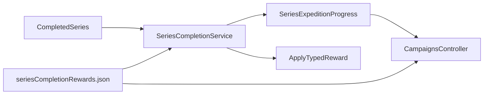

# Series Expedition Map Plan

## Target Behavior

Replace the current d10-based souvenir system with one shared expedition track:

- Each fully completed series advances the keeper to the next stop on the map.
- Progress is global, not per-series.
- Rewards are deterministic and applied automatically in stop order.
- The Campaigns UI shows the expedition map, current position, unlocked stops, and stop flavor text.

## Data Model

Update [assets/data/seriesCompletionRewards.json](/workspaces/tome-of-secrets/assets/data/seriesCompletionRewards.json) from a flat roll table into a structured expedition definition.

Recommended shape:

```json
{
  "id": "expedition-for-the-unwritten-ember",
  "name": "Expedition for the Unwritten Ember",
  "mapImage": "assets/images/maps/chronicle-map.png",
  "coordinateSystem": "normalized-100",
  "stops": [
    {
      "id": "stop-1",
      "order": 1,
      "name": "The Wrought-Iron Threshold",
      "story": "...",
      "position": { "x": 10, "y": 15 },
      "reward": {
        "type": "currency",
        "xp": 0,
        "inkDrops": 50,
        "paperScraps": 10,
        "text": "Gain +50 Ink Drops and +10 Paper Scraps."
      }
    }
  ]
}
```

Why this shape:

- It matches the repo’s JSON-first data pipeline via [scripts/generate-data.js](/workspaces/tome-of-secrets/scripts/generate-data.js) and [assets/js/character-sheet/data.js](/workspaces/tome-of-secrets/assets/js/character-sheet/data.js).
- `stops` as an ordered array is easier to validate and render than numeric object keys.
- A typed `reward` object avoids the current brittle reward-by-name logic in [assets/js/services/SeriesCompletionService.js](/workspaces/tome-of-secrets/assets/js/services/SeriesCompletionService.js).
- `mapImage` should be rendered through the existing CDN/local helper in [assets/js/utils/imageCdn.js](/workspaces/tome-of-secrets/assets/js/utils/imageCdn.js).

## Service And State Changes

Refactor [assets/js/services/SeriesCompletionService.js](/workspaces/tome-of-secrets/assets/js/services/SeriesCompletionService.js) from “roll and claim one souvenir for this series” into “advance the shared expedition if this series has not been counted yet.”

Planned responsibilities:

- Keep `canClaimSeriesCompletionReward(seriesId, stateAdapter)` as the completion gate, but reinterpret it as “can this series advance the expedition?”
- Replace `getSeriesCompletionRewardByRoll()` with helpers like:
  - `getSeriesExpedition()`
  - `getCurrentSeriesExpeditionStop(stateAdapter)`
  - `getNextSeriesExpeditionStop(stateAdapter)`
  - `advanceSeriesExpedition(seriesId, stateAdapter, deps)`
- Replace hard-coded reward-name branches with typed reward application logic.

State updates:

- Extend [assets/js/character-sheet/storageKeys.js](/workspaces/tome-of-secrets/assets/js/character-sheet/storageKeys.js) and [assets/js/character-sheet/stateAdapter.js](/workspaces/tome-of-secrets/assets/js/character-sheet/stateAdapter.js) with a dedicated expedition progress structure, preferably a claim log such as `seriesExpeditionProgress: [{ seriesId, stopId, claimedAt }]`.
- Because there are no existing published saves to migrate, [assets/js/character-sheet/dataMigrator.js](/workspaces/tome-of-secrets/assets/js/character-sheet/dataMigrator.js) only needs a straightforward schema bump with an empty default.
- The existing `claimedSeriesRewards` array can either be removed or left as legacy-only compatibility; the cleanest plan is to replace it fully if no other code depends on it.

## Campaigns UI

Expand [assets/js/controllers/CampaignsController.js](/workspaces/tome-of-secrets/assets/js/controllers/CampaignsController.js) so the Campaigns tab shows expedition progress in addition to the series list.

UI plan:

- Add a map section to [character-sheet.md](/workspaces/tome-of-secrets/character-sheet.md) above or near the series list.
- Render the base map image with markers positioned from `position.x` and `position.y`.
- Visually distinguish past, current, and locked stops.
- Show the active stop’s name, story, and reward summary in a detail panel.
- Remove the current `Claim souvenir` button flow, since progression is automatic.
- When a series newly qualifies and is advanced, show a toast with the unlocked stop and reward text.

Styling will live in [assets/css/character-sheet.css](/workspaces/tome-of-secrets/assets/css/character-sheet.css), using the repo’s existing controller-driven markup approach rather than a new framework.

## Reward Semantics

Normalize rewards by type instead of display name. Likely supported types for this first pass:

- `currency`
- `item-slot-bonus`
- `familiar-slot-bonus`
- `temporary-buff`
- `passive-rule-modifier`
- `curse-removal`

Implementation note:

- Pure currency and simple slot bonuses can be applied immediately in the service.
- Passive rule modifiers that affect other systems should be represented explicitly, not left as text-only rewards. If some stop rewards are still narrative-only at first, mark them with a clear `type` so the service behavior stays predictable.

## Tests

Update [tests/SeriesCompletionService.test.js](/workspaces/tome-of-secrets/tests/SeriesCompletionService.test.js) to cover the new behavior:

- eligible series advances the expedition by exactly one stop
- the same series cannot advance progress twice
- rewards apply in deterministic stop order
- expedition stops at the final stop without overflow
- stop reward application works for each supported reward type
- the returned payload includes enough UI data for toast/detail rendering

Add or extend controller-level tests only if the current test setup already exercises Campaigns rendering; otherwise prioritize the service tests first.

## Implementation Sequence




1. Reshape the expedition JSON and regenerate exports.
2. Introduce typed expedition helpers and new state adapter APIs.
3. Refactor the reward service to advance the global track automatically.
4. Replace the old Campaigns claim button UX with map rendering and stop details.
5. Update tests for the new deterministic progression model.
6. Run data generation and the relevant Jest suite.

